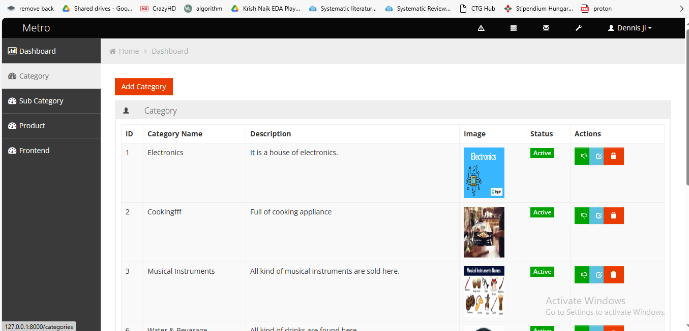

# Ghorer Bazar
## Overview
This repository contains the implementation of a simplified e-commerce platform built using the Laravel framework. The goal of this project was to demonstrate proficiency in Laravel and web development, particularly focusing on CRUD operations for categories, subcategories, and products.

## Features
1. Category Management
Create Category:
Implemented a feature to add new product categories.
Utilized Laravel form validation to ensure the correctness of input data.
-  
2. Subcategory Management
Create Subcategory:
Designed a feature to create subcategories within existing categories.
Established proper data relationships between categories and subcategories.
3. Product Details
Product Details under Subcategory:
Enabled users to add comprehensive product details under specific subcategories.
Implemented validation for product details to maintain data accuracy.
4. Product Viewing
View Product:
Developed a page to view all products, categorized by subcategories.
Utilized slugs for SEO-friendly URLs.
5. CRUD Operations
CRUD Functionality:
Implemented full CRUD functionality for categories, subcategories, and products.
Ensured proper handling of editing and deletion operations.
6. Alert Messages

This project incorporates alert messages to provide users with informative feedback. The following types of alert messages are implemented:

## Technology Stack
Laravel 8: Used the latest version of the Laravel framework for efficient and modern web development.

Database (Eloquent ORM): Leveraged Laravel's Eloquent ORM for database interactions, ensuring a clean and expressive syntax.

Migration and Seeding: Employed Laravel migrations and seeders for database schema creation and initial data population.

Form Validation: Implemented Laravel's built-in form validation to ensure the correctness of user inputs.

Slug Generation: Utilized slugs for generating SEO-friendly URLs, enhancing the user experience.